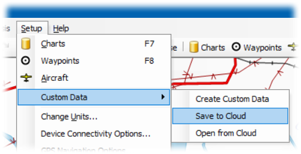
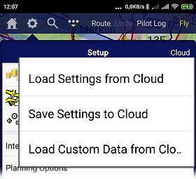

# SkyDemon Add-on
[Skydemon](https://skydemon.aero) is a navigation application for VFR flying. Additions for LKAA (Czech Republic):
- TRA GA
- Aerodrome circuits
- VFR arrival / departure routes

## How to use it
### PC
1. [Download custom data files](https://github.com/petrd/SkyDemon/archive/master.zip) to your PC.
2. Copy the files to Documents > Skydemon > CustomData
3. Run Skydemon on your PC and verify custom data
4. Save Custom Data to Cloud (*Setup > Custom Data > Save to Cloud*)

5. Run Skydemon on each of your mobile devices and load Custom Data from the Cloud (*Setup > Cloud > Load Custom Data from Cloud*)

### Mobile only
If you don't want to use the PC, you can try downloading the files directly on your mobile device and copying them to Skydemon/CustomData folder - if you can find it on your mobile device.

*Use of data is without guarantee. The pilot is obliged to verify the data from official sources.*
